# LifeLink - Blood Donation Management System

LifeLink is a full-stack Blood Donation Management System built using Node.js, Express.js, MongoDB, EJS and Tailwind CSS.

## Live Demo

https://lifelink-blood-donation-management-system.onrender.com

## Features

- User Authentication
- Donor Registration
- Blood Request Management
- Dashboard
- Contact Form
- Session Based Login System

## Tech Stack

- Node.js
- Express.js
- MongoDB
- Mongoose
- EJS
- Tailwind CSS

## Screenshots

### Home

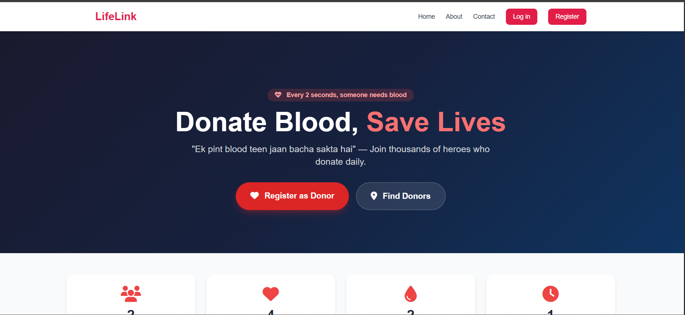
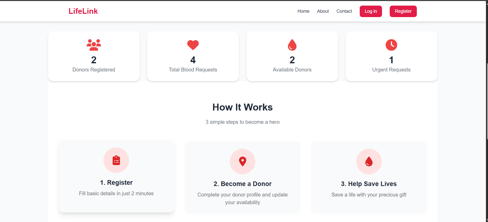

### About

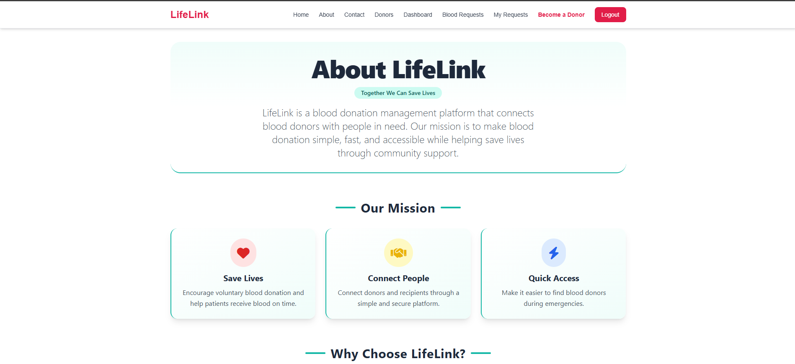
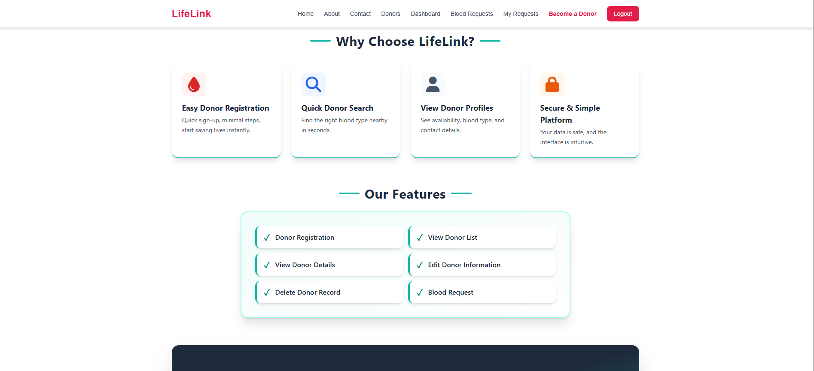

### Become a Donor

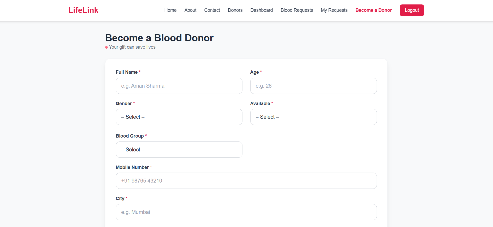
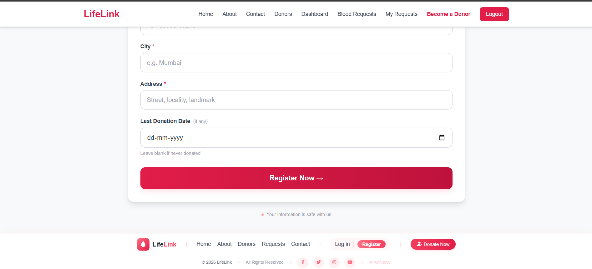

### Blood Request

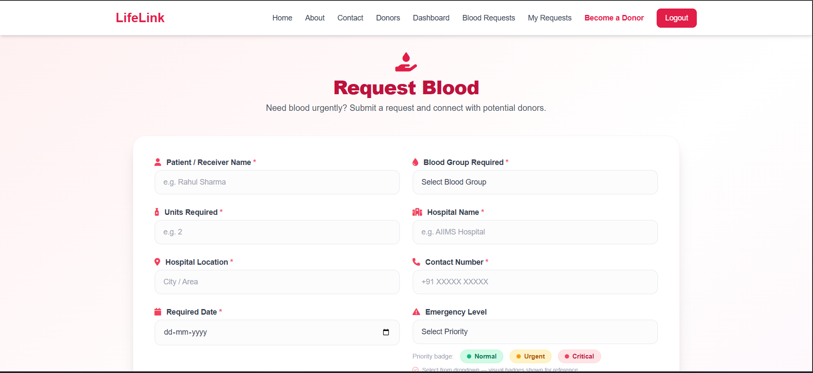
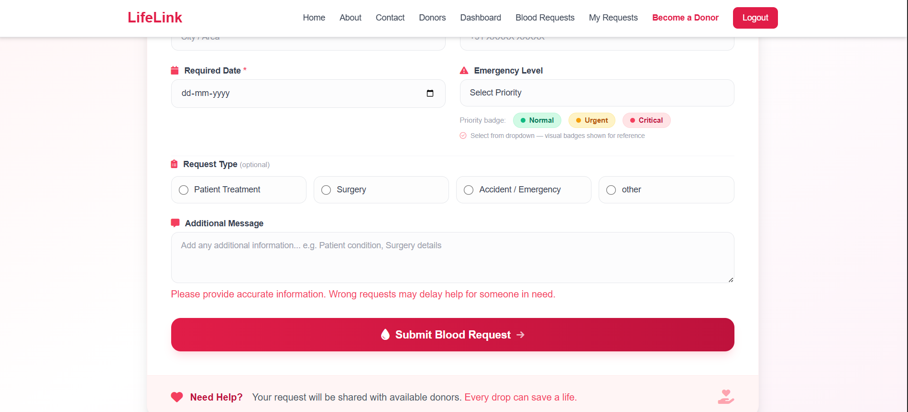

### Dashboard

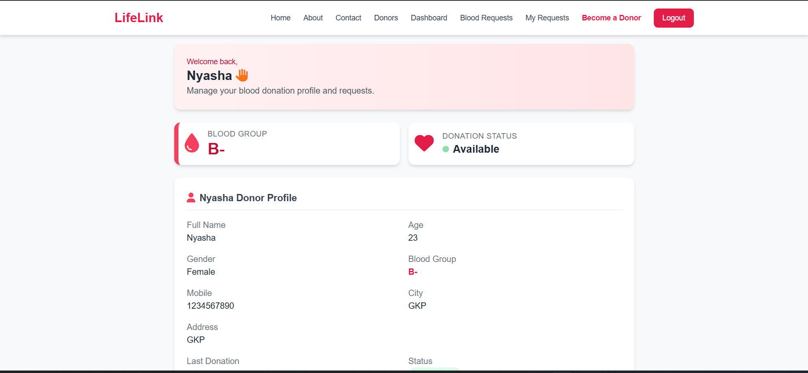
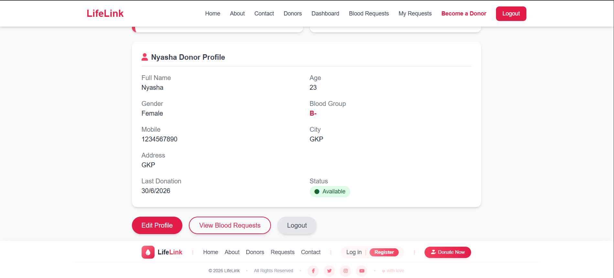

### Contact

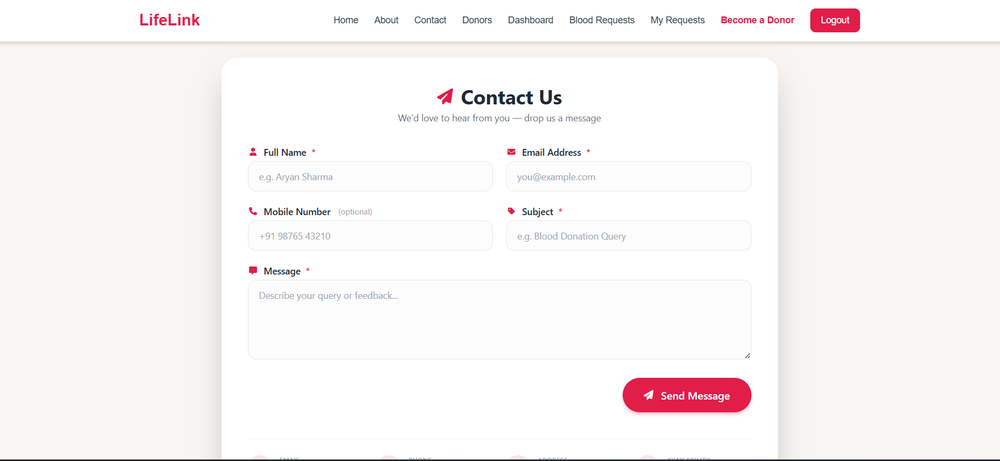
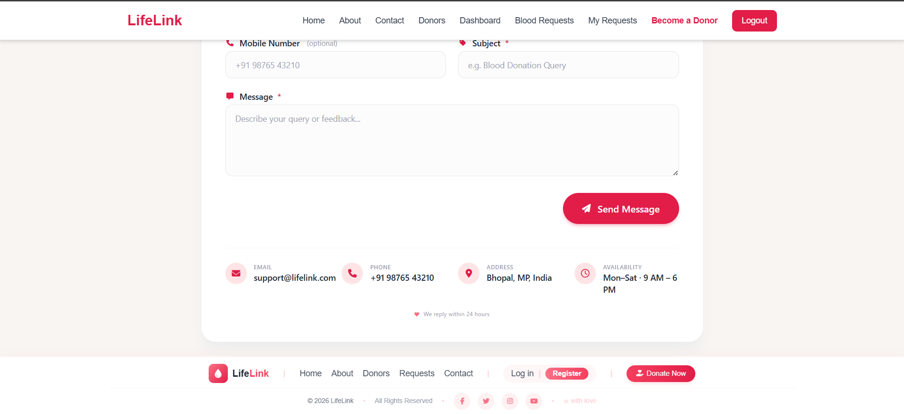

### Donor List

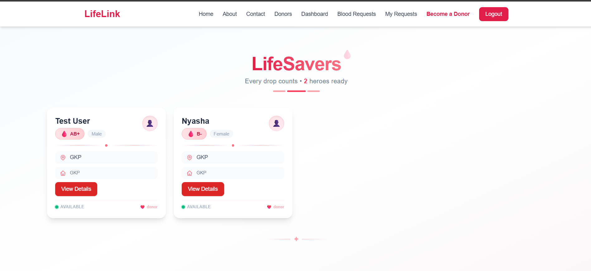

### Login

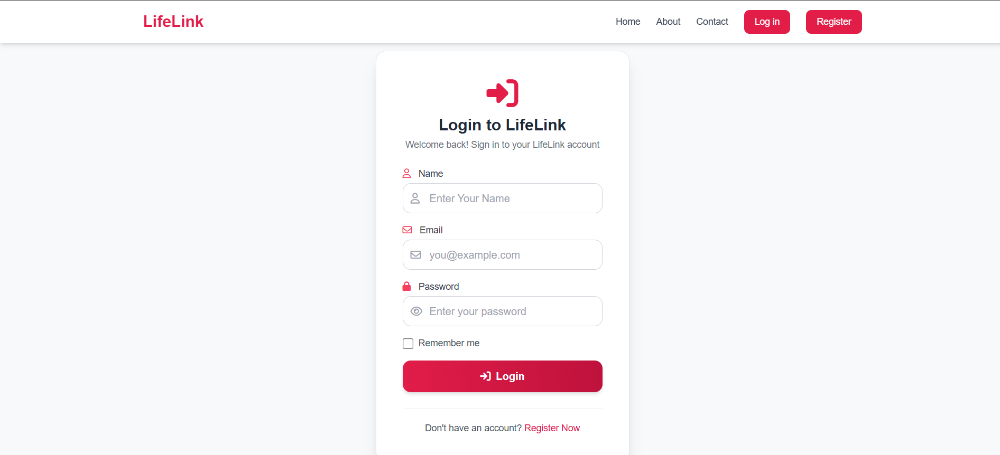

### My Request

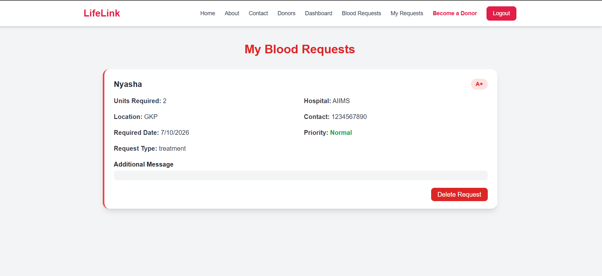

### Register

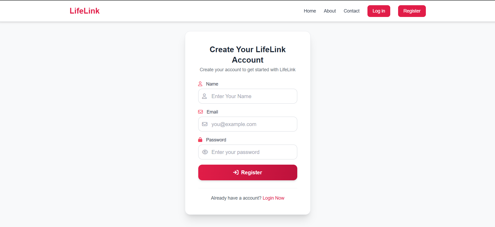

## Installation

Clone the repository:

npm install

Create .env file and add:

MONGO_URL=your_mongodb_url

Run project:

npm start

## Author

**Nyasha**

- Github: 
https://github.com/Nyasha2421